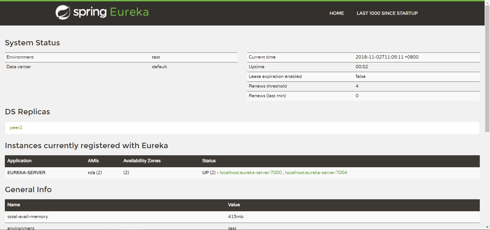

## 总架构图


---

> 学习博客：http://www.mooooc.com/spring-cloud.html
           https://blog.csdn.net/forezp/article/details/70148833
> spring boot 版本2.0以上
> 服务启动顺序，eureka-server 》config-server 》admin-server 》admin-client 。。。。

### 一、eureka 服务的注册与发现
#### ①依赖
```java
<dependency>
  <groupId>org.springframework.cloud</groupId>
  <artifactId>spring-cloud-starter-netflix-eureka-server</artifactId>
</dependency>
```

#### ②开启服务注册  
    通过 *@EnableEurekaServer* 注解启动一个服务注册中心提供给其他应用进行对话,这个注解需要在springboot工程的启动application类上加
````java
@SpringBootApplication
@EnableEurekaServer
public class EurekaServerApplication {

	public static void main(String[] args) {
		SpringApplication.run(EurekaServerApplication.class, args);
	}
}
````
#### ③单点配置
application.yml
````java
spring:
  application:
    name: eureka-server
server:
  port: 7000
eureka:
  client:
    register-with-eureka: false # 不向注册中心注册自己
    fetch-registry: false # 表示自己端就是注册中心，我的职责就是维护服务实例，并不需要去检索服务
    service-url:
      defaultZone: http://peer2:7004/eureka/ # 地址
````

#### ④集群配置(去除register-with-eureka: false,fetch-registry: false)
- application.yml
````java
spring:
  application:
    name: eureka-server
  profiles:
    active: peer1
info:
  version: @project.version@ # 显示版本信息
````
- application-peer1.yml
````java
server:
  port: 7000
spring:
  profiles: peer1
eureka:
  instance:
    hostname: peer1
  client:
#    register-with-eureka: false # 不向注册中心注册自己
#    fetch-registry: false # 表示自己端就是注册中心，我的职责就是维护服务实例，并不需要去检索服务
    service-url:
      defaultZone: http://peer2:7004/eureka/ # 地址

````
- application-peer2.yml
````java
server:
  port: 7004
spring:
  profiles: peer2
eureka:
  instance:
    hostname: peer2
  client:
#    register-with-eureka: false # 不向注册中心注册自己
#    fetch-registry: false # 表示自己端就是注册中心，我的职责就是维护服务实例，并不需要去检索服务
    service-url:
      defaultZone: http://peer1:7000/eureka/ # 地址
````
- host转换
在hosts文件中加入如下配置
````java
127.0.0.1 peer1
127.0.0.1 peer2
````

- 开启ip地址配置，通过ip地址注册则无需添加host
````java
eureka:
  instance:
    prefer-ip-address: true #是否显示IP地址
````

- 启动两个eureka-server
 
#### ⑤结果
- 访问 http://localhost:7000/

- 访问 http://localhost:7004/


### 二、服务提供者
#### ①依赖
````java
<dependency>
  <groupId>org.springframework.cloud</groupId>
  <artifactId>spring-cloud-starter-netflix-eureka-client</artifactId>
</dependency>
````
#### ②启动类
springboot工程的启动application类上加@EnableEurekaClient或者@EnableDiscoveryClient注解
````java
@SpringBootApplication
@EnableEurekaClient
@RestController
public class AdminClientApplication {

    public static void main(String[] args) {
        SpringApplication.run(AdminClientApplication.class, args);
    }
    
    @Value("${server.port}")
    private String port;

    @RequestMapping("/hello")
    public String like(@RequestParam(value = "name") String name) {
        return "Hello," + name + ".my port is:" + port;
    }
}

````
### ③配置
````java
server:
  port: 7010
spring:
  application:
    name: admin-client
eureka:
  client:
    healthcheck:
      enabled: true # 开启健康检查（依赖spring-boot-starter-actuator）
    service-url:
          defaultZone: http://localhost:7000/eureka/ # 注册到其中一个eureka-server即可
  instance:
    prefer-ip-address: true #是否显示IP地址
    instance-id: ${spring.cloud.client.ip-address}:${server.port}
    lease-expiration-duration-in-seconds: 30 # 发呆时间，即服务续约到期时间（缺省为90s）
    lease-renewal-interval-in-seconds: 10 # 心跳时间，即服务续约间隔时间（缺省为30s）
````

### 三、服务消费者
> rest+ribbon 
#### ①依赖
````java
<!--客户端的负载均衡依赖-->
<dependency>
    <groupId>org.springframework.cloud</groupId>
    <artifactId>spring-cloud-starter-netflix-ribbon</artifactId>
</dependency>

<!--断路器-->
<dependency>
  <groupId>org.springframework.cloud</groupId>
  <artifactId>spring-cloud-starter-netflix-hystrix</artifactId>
</dependency>
````
#### ②启动类
````java
@SpringBootApplication
@EnableEurekaClient
@EnableHystrix // 开启短路器
public class ServerConsumerApplication {

	public static void main(String[] args) {
		SpringApplication.run(ServerConsumerApplication.class, args);
	}

	@Bean
    @LoadBalanced // 开启负载均衡功能 轮询
    RestTemplate restTemplate(){
	    return new RestTemplate();
    }
}
````
#### ③server层
````java
@RestController
public class HelloController {
    @Autowired
    HelloService helloService;

    @RequestMapping("/hello")
    public String hi(@RequestParam(value = "name",defaultValue = "flyxiaozhu") String name){
        return helloService.hiService(name);
    }
}
````

#### ④controller层
````java
@Service
public class HelloService {
    @Autowired
    RestTemplate restTemplate;

    @HystrixCommand(fallbackMethod = "hiError") // 熔断器
    public String hiService(String name) {
        return restTemplate.getForObject("http://admin-client/hello?name=" + name, String.class);
    }

    public String hiError(String name) {
        return "Hi," + name + ".sorry!!!error...";
    }
}
````

> feign
#### ①依赖
````java
<!--feign 消费者依赖 -->
<dependency>
    <groupId>org.springframework.cloud</groupId>
    <artifactId>spring-cloud-starter-openfeign</artifactId>
</dependency>

<!--断路器-->
<dependency>
  <groupId>org.springframework.cloud</groupId>
  <artifactId>spring-cloud-starter-netflix-hystrix</artifactId>
</dependency>
````
#### ②启动类
````java
@SpringBootApplication
@EnableEurekaClient
@EnableFeignClients
public class ServerFeignApplication {

	public static void main(String[] args) {
		SpringApplication.run(ServerFeignApplication.class, args);
	}
}
````

#### ③server层
- Hiserver 接口
````java
@FeignClient(value = "admin-client",fallback = HiServiceImpl.class)
public interface HiService {
    @RequestMapping(value = "/hello")
    String sayLikeClientOne(@RequestParam(value = "name") String name);
}
````
- HiServerImpl 实现类
````java
@Component
public class HiServiceImpl implements HiService {
    @Override
    public String sayLikeClientOne(String name) {
        return "sorry," + name;
    }
}
````

#### ④controller层
````java
@RestController
public class HiController {
    @Autowired
    HiService hiService; // 编译器报错，无视。 因为这个Bean是在程序启动的时候注入的，编译器感知不到，所以报错

    @RequestMapping("/hello")
    public String like(@RequestParam(value = "name", defaultValue = "flyxiaozhu") String name) {
        return hiService.sayLikeClientOne(name);
    }
}
````

### 四、网关 zuul
#### ①依赖
````java
<dependency>
  <groupId>org.springframework.cloud</groupId>
  <artifactId>spring-cloud-starter-netflix-zuul</artifactId>
</dependency>
````
#### ②启动类
````java
@SpringBootApplication
@EnableEurekaClient
@EnableZuulProxy
public class ServerZuulApplication {

	public static void main(String[] args) {
		SpringApplication.run(ServerZuulApplication.class, args);
	}
}
````
#### ②过滤
````java
@Component
public class MyFilter extends ZuulFilter{

    private static Logger log = LoggerFactory.getLogger(MyFilter.class);

    // 返回一个字符串代表过滤器的类型
    // 生命周期：
    // pre：路由之前
    // routing：路由之时
    // post： 路由之后
    // error：发送错误调用
    @Override
    public String filterType() {
        return "pre";
    }

    // 过滤的顺序
    @Override
    public int filterOrder() {
        return 0;
    }

    // 这里可以写逻辑判断，是否要过滤，本文true,永远过滤。
    @Override
    public boolean shouldFilter() {
        return true;
    }

    // 过滤器的具体逻辑。可用很复杂，包括查sql，nosql去判断该请求到底有没有权限访问。
    @Override
    public Object run() throws ZuulException {
        RequestContext ctx = RequestContext.getCurrentContext();
        HttpServletRequest request = ctx.getRequest();

        log.info(String.format("%s >>> %s",request.getMethod(),request.getRequestURL().toString()));

        Object accessTonken = request.getParameter("token");
        if(accessTonken == null){
            log.warn("token is empty");

            ctx.setSendZuulResponse(false);
            ctx.setResponseStatusCode(401);

            try{
                ctx.getResponse().getWriter().write("token is empty");
            }catch (Exception e){
                log.error(e.getMessage());
            }
            return null;
        }
        log.info("ok");
        return null;
    }
}
````

### 五、分布式配置中心


### 六、spring-boot-admin


