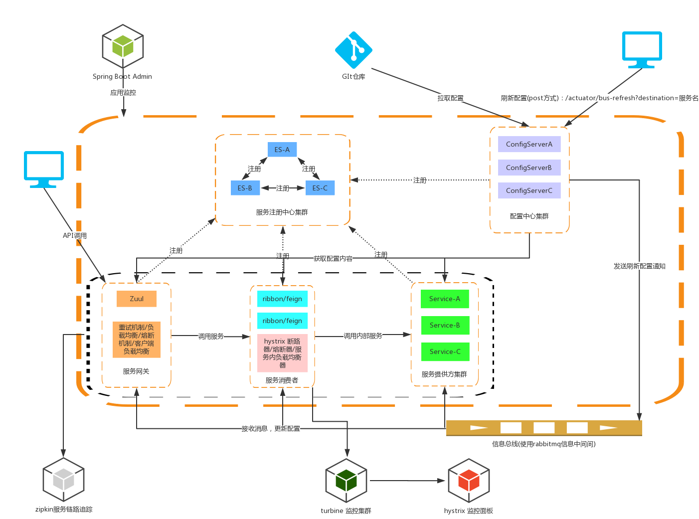

## 总架构图

---

> 学习博客：http://www.mooooc.com/spring-cloud.html  
https://blog.csdn.net/forezp/article/details/70148833  
https://windmt.com/2018/04/24/spring-cloud-12-sleuth-zipkin/  

### 环境
> spring boot 版本：2.0.6.RELEASE  
mvn构建工具  
docker容器  
docker-compose

### 启动
- 构建jar包（根目录下）
> mvn clean  
mvn compile  
mvn package  

或者
> mvn clean install

- 构建镜像，启动容器
> docker-compose up -d --build

### 使用 
- eureka server   
    功能：服务注册中心

- spring boot admin  
    功能：监控应用，查看应用运行信息
> 访问 http://主机:7020  
账号：flyxiaozhu  
密码：123456 

- config server  
    功能：配置中心
    
- server hello  
    功能：服务提供者
    
- ribbon/feign server  
    功能：服务消费者、熔断器、服务端负载均衡
    
- zuul gateway    
    功能：路由转发、熔断器、过滤器、客户端负载均衡  
    api-a 路由转发给 ribbon-server，api-b 路由转发给 feign-server。token 参数必须有，因为自定义了过滤器。
> 访问  
http://主机:7070/api-a/hello?token=key  
http://主机:7070/api-b/hello?token=key   
http://主机:7070/api-b/test?token=key  # 可以测试自动刷新配置  
http://主机:7070/api-b/test2?token=key # 可以测试 feign 集群

- zipkin 服务链路追踪
> 通过docker运行zipkin服务端   docker run -p 9411:9411 -d openzipkin/zipkin  
访问 http://主机:9411  

- turbine server   
    功能：hystrix 监控集群，监控 ribbon/feign server
    
- hystrix dashboard  
    功能：hystrix 监控面板
> 访问 http://主机:7060/hystrix
  
> 输入  http://主机:7050/turbine.stream
  

### 未实现
- zipkin 服务链路和 hystrix 监控使用的是http方式，可改成使用消息中间件 rabbitmq
- zipkin 的数据并未持久化

